## Game\_ATmega16

#### 12 игр на голом МК ATmega16 и маленьком OLED SSD1306 (128x32) с необычным управлением кнопка + ИК датчик обнаружения препятствий YL-63 (FC-51).

 

**Список игр:**

> 1. **DODGE&#x20;**— уклонение: препятствия летят навстречу по двум линиям, нужно вовремя перестраиваться (кнопка или датчик YL-63 = сменить линию).
> 2. **FLAPPY&#x20;**— аркада: управляем птичкой, летящей через узкие щели в столбах (кнопка или датчик YL-63 = прыжок).
> 3. **SNAKE&#x20;**— классическая змейка: собираем еду и растем, избегая стен и своего хвоста (датчик YL-63 = поворот налево, кнопка = поворот направо относительно головы змеи).
> 4. **RACE&#x20;**— гонки: едем по трем полосам и уворачиваемся от встречных машин (датчик YL-63 = влево, кнопка = вправо).
> 5. **PONG&#x20;**— одиночный пинг-понг: отбиваем ускоряющийся мячик от стены (датчик YL-63 = ракетка вверх, кнопка = ракетка вниз, можно удерживать).
> 6. **BRICK&#x20;**— арканоид: отбиваем мяч платформой, чтобы разбить все блоки сверху экрана (датчик YL-63 = влево, кнопка = вправо, можно удерживать).
> 7. **INVADER&#x20;**— космический тир: нужно сбить как можно больше пришельцев за 60 секунд (датчик YL-63 = двигать пушку влево по кругу, кнопка = выстрел вверх).
> 8. **JUMPER&#x20;**— платформер: бежим вперед и перепрыгиваем генерирующиеся ямы (кнопка или датчик YL-63 = прыжок / двойной прыжок в воздухе, долгое нажатие = прыгнуть выше).
> 9. **TAPPER&#x20;**— реакция: падают капли сверху в 4 колонках, нужно успевать подставлять стакан (датчик YL-63 = влево, кнопка = вправо).
> 10. **AVOIDER&#x20;**— выживание: уворачиваемся от летящих сбоку снарядов, вертикальные снаряды только отвлекают (кнопка или датчик YL-63 = сменить позицию игрока верх/низ).
> 11. **REFLECT** — пинг-понг наоборот: шар летает от края к краю, нужно включать защитную стенку с той стороны, куда он летит в данный момент (кнопка или датчик YL-63 = переключить стенку слева/справа).
> 12. **MORSE&#x20;**— память: запоминаем и повторяем последовательность световых сигналов, которая увеличивается с каждым раундом (кнопка или датчик YL-63: короткое нажатие = точка, удержание = тире).

Код написан в **Arduino IDE 2.3.8**, но из-за ограниченного объёма памяти, используются регистры и Cи код, драйвер OLED дисплея написан с нуля для данного проекта, что бы сэкономить память,  это позволило вместить до 12 игр.

Рейтинг каждой игры хранится в EEPROM, что бы очистить рейтинг, нужно зажать кнопку и падать питание.

Ссылки на [**GitFlic**](https://gitflic.ru/project/otto/game_atmega16) и [**GitHub**](https://github.com/Otto17/Game_ATmega16).

---

**Настройки в Arduino IDE выставлены такие:**

```plaintext
Плата: MightyCore -> ATmega16
Baud rate: 115200
BOD: BOD 2.7V
Bootloader: No bootloader
Clock: External 16 MHz
EEPROM: EEPROM retained
JTAG pins: JTAG disabled
Compiler LTO: LTO enabled
Pinout: Standard pinout
Программатор: USBasp
```

 

**Fuses (если шить через AvrDudeProg ver5.6):**

```plaintext
Lock (lock):  FF
High (hfuse): CF
Low (lfuse):  BF
```

---

**Схема:**
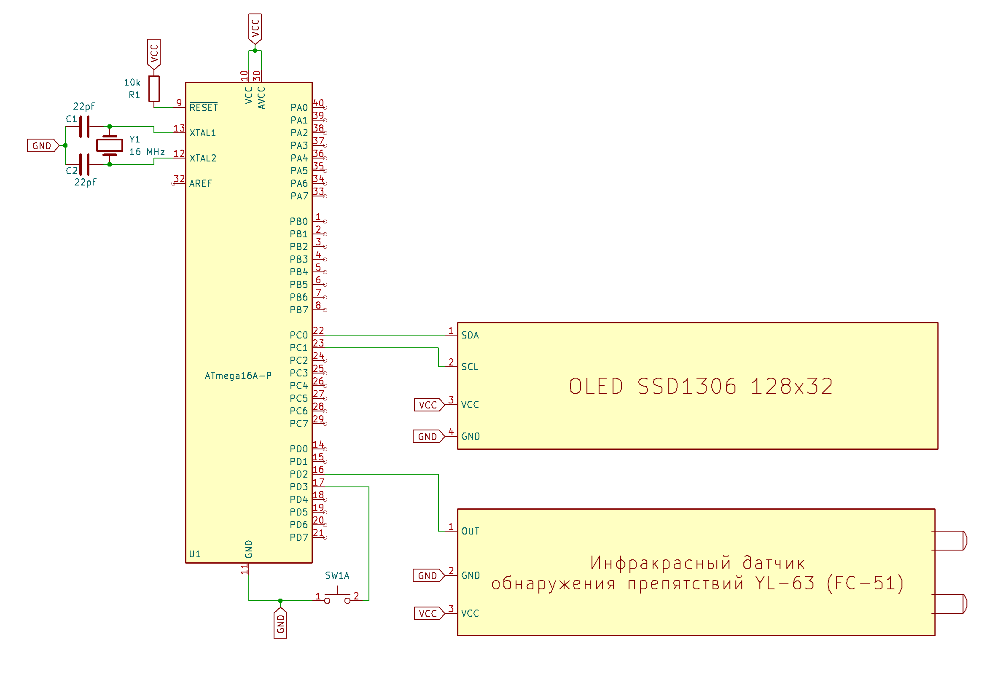

**Колхозный корпус:**
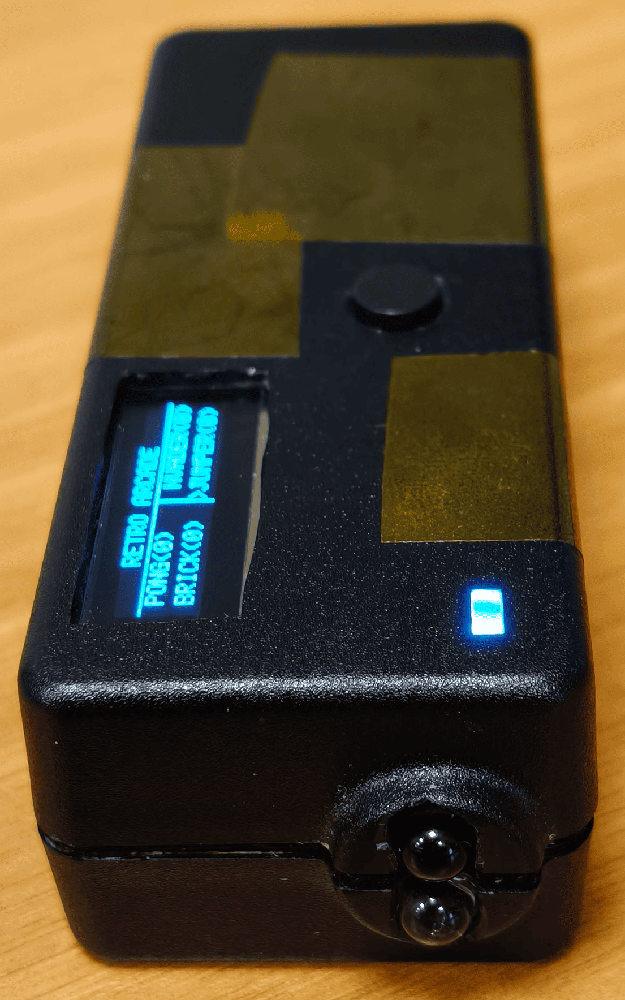
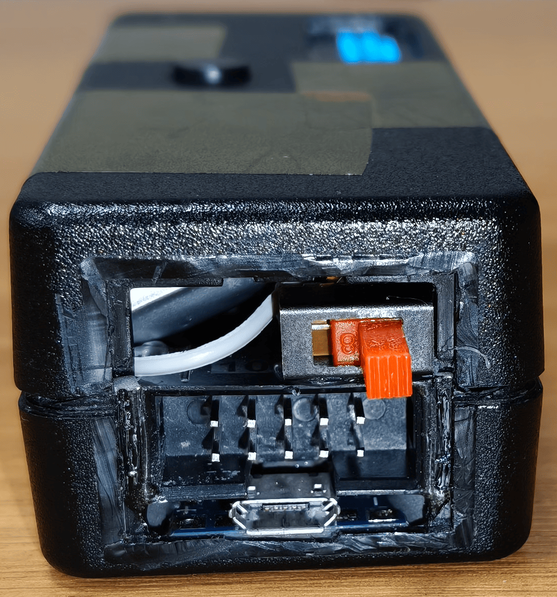

**Фото игр:**
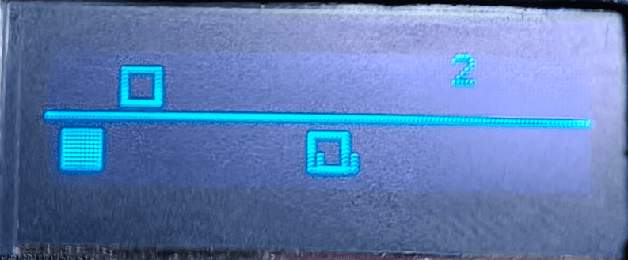
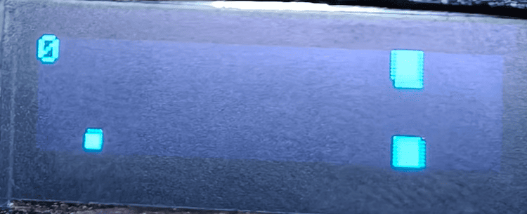
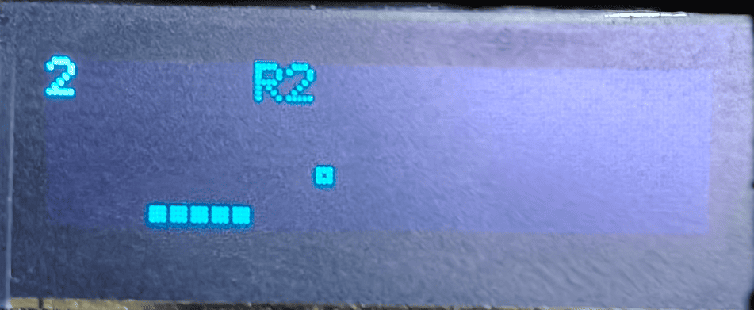
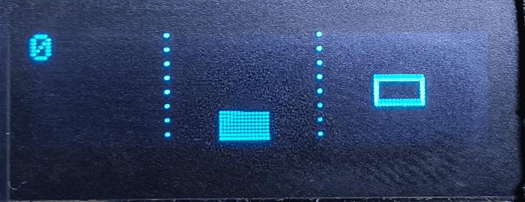
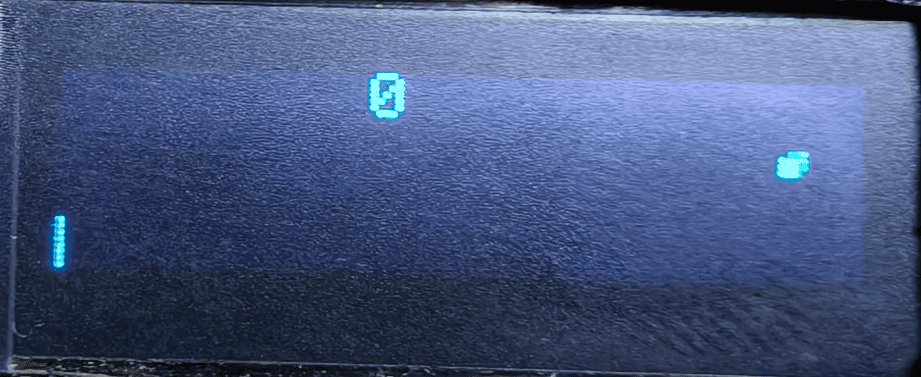
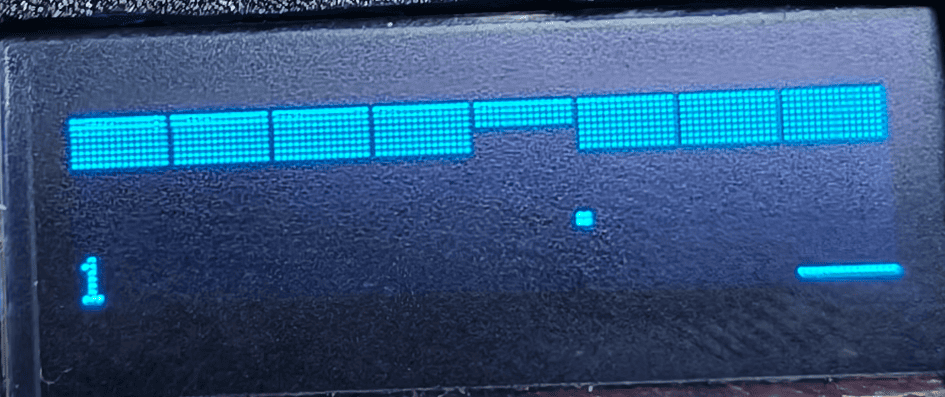
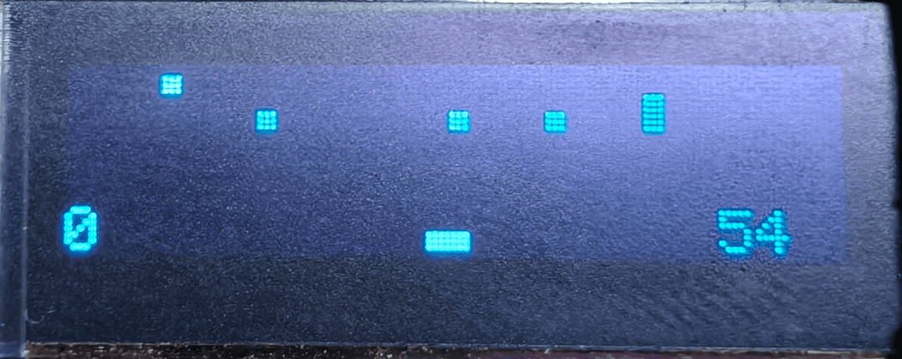
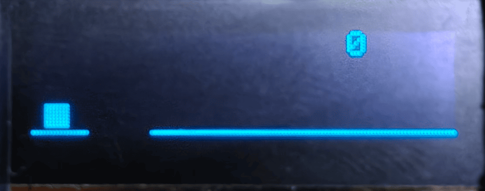
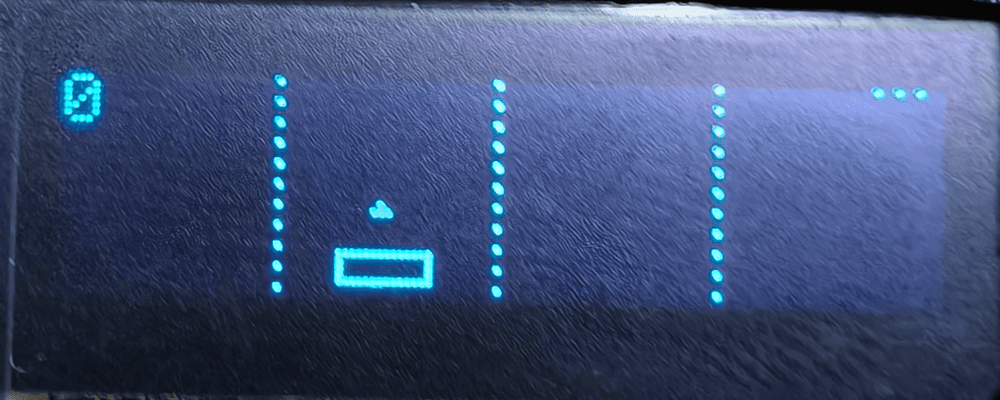
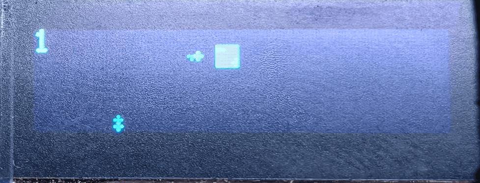
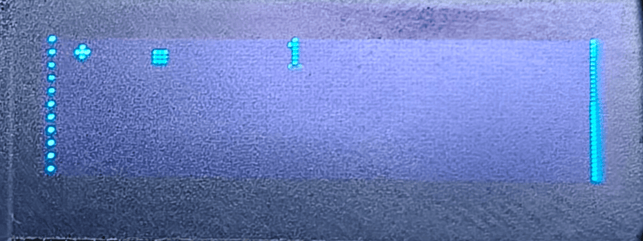
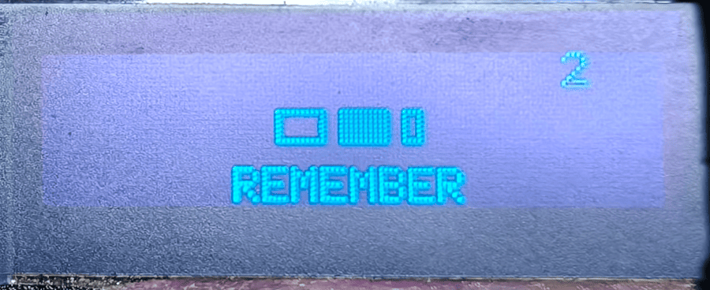

##  

_На вопрос "Зачем это ?", отвечу, что это просто хобби, к тому же давно думал, куда бы применить этот кирпич в виде ATmega16 DIP-40, а необычное управление в виде ИК датчика мне показалось очень необычным на практике, мне это понравилось, хоть и обычная кнопка будет немного удобнее._

---

**Автор Otto, г. Омск 2026**